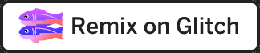
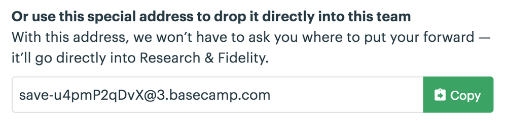

# Stimulus의 기원

**Basecamp**에서 많은 자바스크립트를 작성하지만 현대적인 의미에서 “자바스크립트 애플리케이션”을 만드는 데 사용하지는 않습니다. 여기서 제작하는 모든 애플리케이션에는 서버측 렌더링 HTML이 핵심으로 포함되어 있으며 자바스크립트를 필요한 곳에 추가하여 빛을 발하게 합니다.

이것이 장엄한 모놀리스([majestic monolith](https://m.signalvnoise.com/the-majestic-monolith-29166d022228))의 방식입니다. **Basecamp**는 **Ruby on Rails**를 사용하여 생성된 단일 컨트롤러, 뷰 및 모델 세트와 함께 기본 모바일 앱을 포함하여 십여 개의 플랫폼에서 실행됩니다. 단일 장소에서 업데이트할 수 있는 하나의 인터페이스를 공유하는 것은 많은 플랫폼에도 불구하고 소규모 팀과 함께 수행할 수 있는 핵심 요소입니다.

이런 연유로 예전과 같이 상당한 생성성을 가지게 됩니다. 그러나, 단일 프로그래머가 간접적인 계층이나 분산 시스템에 얽매이지 않고 많은 발전을 이룰 때 오히려 후퇴하는 것이다. 모든 사람들이 성배를 생각하기 전에는 서버 측 애플리케이션을 자바스크립트 기반 클라이언트 애플리케이션에서 사용할 JSON을 생성하는 것으로 제한해야 한다고 생각했습니다.

그렇다고 일부 사람들에게 그러한 접근 방식에는 가치가 없다고 말하는 것은 아닙니다. 많은 애플리케이션에 대한 일반적인 접근 방식, 특히 **Basecamp**와 같은 일반적인 접근 방식은 전반적인 단순성과 생산성에 대한 퇴보인 것입니다.

또한 단일 페이지 자바스크립트 응용 프로그램의 확산으로 실제 이점을 얻지 못했다고 말할 수는 없습니다. 더 빠르고 유동적인 인터페이스 중 하나는 전체 페이지를 새로 고치지 않아도 됩니다.

**Basecamp**도 그렇게 느끼기를 원했습니다. 마치 우리는 무리를 따라 클라이언트 측 렌더링으로 모든 것을 다시 작성했거나 모바일에서 완전히 네이티브인 것처럼 보이게 했습니다.

이와 같은 희망으로 [Turbolinks](https://github.com/turbolinks/turbolinks) 와 **Stimulus** 두 개의 솔루션을 가지게 되었습니다.


## Turbolinks는 높이고 Stimulus는 낮추기

새로운 최소한의 자바스크립트 프레임워크인 **Stimulus** 에 접하기 전에 **Turbolinks**의 제안을 다시 살펴 보도록 하겠습니다.

**Turbolinks**는 **GitHub**에서 개발된 **pjax**라는 접근 방식에서 비롯됩니다. 기본 개념은 동일합니다. 전체 페이지 새로 고침이 느리게 느껴지는 이유는 대부분이 브라우저가 서버에서 보낸 많은 HTML을 처리해야 하기 때문이다. 브라우저는 정말 훌륭하고 빠릅니다. 그리고 대부분의 경우에서 HTML 페이로드가 JSON 페이로드보다 큰 경향이 있다는 사실은 중요하지 않습니다 (특히 gzipping의 경우). 그러나 실제로 그렇지 않습니다. CSS와 자바스크립트를 다시 초기화하여 페이지에 다시 적용해야하기 때문입니다. 파일 자체가 캐시되는지 여부에 관계없이 CSS와 자바스크립트가 상당히 많으면 속도가 느려질 수 있습니다.

이와 같은 재차 초기화하는 작업을 피하기 위해 **Turbolinks**는 단일 페이지 애플리케이션과 마찬가지로 지속적인 프로세스를 유지합니다. 그러나 육안적으로는 확인할 수 없습니다. **Ajax**를 통해 링크를 가로 채고 새 페이지를 로드합니다. 서버는 여전히 완전한 형식의 HTML 문서를 반환합니다.

이 전략만으로도 대부분의 애플리케이션에서 대부분의 작업을 매우 빠르게 수행 할 수 있습니다 (캐싱을 통해 서버 응답을 100-200ms 내에 반환 할 수 있는 경우). **Basecamp**의 경우 페이지 간 전환 속도가 ~ 3 배 빨라졌습니다. 단일 페이지 애플리케이션에 대한 호소력의 상당 부분인 응답성과 유동성을 갖춘 애플리케이션을 제공합니다.

그러나 **Turbolinks**만으로는 이야기의 절반에 지나지 않습니다. 대략적인 내용에 불과합니다. 단일 페이지 내의 모든 세부적인 내용이 전체 페이지 변경 등급 아래에 있습니다. 요소를 표시하거나 숨기고, 컨텐츠를 클립 보드에 복사하고, 새로운 할 일을 목록에 추가하고, 우리가 현대 웹 애플리케이션과 연관시키는 다른 모든 상호 작용을 수행합니다.

**Stimulus** 이전에 **BaseCamp**는 이러한 스타일을 적용하기 위해 다양한 스타일과 패턴을 사용했습니다. 일부 코드는 jQuery였고 일부 코드는 비슷한 크기의 바닐라 자바스크립트이었으며 일부는 더 큰 객체지향 서브시스템이었습니다. 일반적으로 `data-behavior` 속성을 정지시키고 명시적 이벤트 처리를 수행했습니다.

이와 같은 새로운 코드를 쉽게 추가 할 수는 있었지만 포괄적인 솔루션은 아니었고 너무 많은 사내 스타일과 패턴이 공존했습니다. 이로 인해 코드를 재사용하기가 어려워졌으며 새로운 개발자가 일관된 접근 방식을 배우기가 어려워졌습니다.


## Stimulus의 세가지 핵심 개념

**Stimulus**는 이러한 패턴 중 최고의 패턴을 컨트롤러, 액션 및 타겟의 세 가지 주요 개념을 중심으로 하는 작고 작은 프레임워크로 정리했습니다. 

접속하는 HTML이 점진적으로 향상되어([a progressive enhancement](https://en.wikipedia.org/wiki/Progressive_enhancement)) 읽히도록 설계되었습니다(브라우저와 인터넷 상태에 따라 기본 컨텐츠와 기타 특수한 효과를 점진적으로 보여주는 웹디자인 방식. 역주). 단일 템플릿을 보고 어떤 동작이 수행되는지 알 수 있습니다. 예를 들면 다음과 같습니다.

```html
<div data-controller="clipboard">
  PIN: <input data-target="clipboard.source" type="text" value="1234" readonly>
  <button data-action="clipboard#copy">Copy to Clipboard</button>
</div>
```

코드를 읽을 수 있고 무슨 일이 일어나고 있는지 잘 알 수 있습니다. **Stimulus**에 대해 전혀 알지 못하거나 컨트롤러 코드 자체를 보지 않아도 알 수 있습니다. 의사코드(pseudocode)와 거의 같습니다. 외부 자바스크립트 파일이 이벤트 처리기를 적용하는 HTML 코드 일부를 읽는 것과는 매우 다릅니다. 또한 많은 최신 자바스크립트 프레임워크에서 빠진 SoC([Separation of Concerns](https://en.wikipedia.org/wiki/Separation_of_concerns), 관심사의 분리)를 관리합니다.

보시다시피, **Stimulus**는 HTML 생성에 신경을 쓰지 않습니다. 오히려 기존 HTML 문서에 부가되어 작동하게 됩니다. HTML은 대부분의 경우 서버에서 페이지로드 (첫 번째 요청 또는 **Turbolinks**를 통해) 또는 DOM을 변경하는 Ajax 요청을 통해 렌더링됩니다.

**Stimulus**는 이 기존 HTML 문서 조작과 관련이 있습니다. 때로는 요소를 숨기거나 애니메이션을 적용하거나 강조 표시하는 CSS 클래스를 추가하는 것을 의미합니다. 때로는 그룹화에서 요소를 다시 정렬하는 것을 의미합니다. 때로는 캐시할 수 있는 UTC 시간을 표시할 수 있는 현지 시간으로 변환할 때와 같이 요소의 내용을 조작하는 것을 의미합니다.

**Stimulus**가 새로운 DOM 요소를 생성하고 싶을 때가 있으며, 얼마든지 그렇게 할 수 있습니다. 후에 기능을 추가하여 더 손쉽게 만들 수도 있습니다. 그러나 이것은 아주 드문 경우입니다. 촛점은 요소를 만드는 것이 아니라 조작하는 것입니다.


## Stimulus가 주류 자바스크립트 프레임워크와의 차이점

따라서 Stimulus는 최신 자바스크립트 프레임워크와 크게 다릅니다. 거의 대부분이 일종의 템플릿 언어를 통해 JSON을 DOM 요소로 변환하는 데 중점을 둡니다. 많은 사람들이 이 프레임워크를 사용하여 빈 페이지를 생성하고 이와 같은 JSON을 템플릿으로 렌더링하여 생성한 요소로만 채웁니다.

**Stimulus**는 또한 상태 문제에 대해서 차이점을 가집니다. 대부분의 프레임워크에는 자바스크립트 객체 내에 상태를 유지하는 방법을 취하며 해당 상태를 기반으로 HTML을 렌더링합니다. 그러나 **Stimulus**는 정반대입니다. 상태는 HTML에 저장되므로 페이지 변경 간에 컨트롤러를 버릴 수 있지만 캐시된 HTML이 다시 나타날 때와 마찬가지로 컨트롤러가 다시 초기화됩니다.

정말 다른 패러다임입니다. 요즈음 프레임워크 작업에 익숙했던 많은 베테랑 자바스크립트 개발자가 비웃을 것이라고 확신합니다. 그들에게 그냥 비웃고 가버리라고 하세요.  **React + Redux**와 같은 애플리케이션을 유지 관리하는 데 필요한 복잡성과 노력에 만족한다면 **Turbolinks + Stimulus**가 딱히 매력적인 부분이 없을 것입니다.

반면에, 현재 진행 중인 작업이, 요즈음 기술이 암시하는 바와 같이,  애플리케이션에서 복잡한 부분을 분리하지 못할 경우, 이와 같은 접근 방식에서 피난처를 찾을 수 있습니다.


## Stimulus와 관련 아이디어는 현장으로부터 얻은 것이다

**Basecamp**에서는 몇 년 동안 여러 다른 버전의 **Basecamp** 및 기타 애플리케이션에서 이 아키텍처를 사용했습니다. GitHub는 비슷한 효과를 적용했습니다. 이것은 "현대적인" 웹 애플리케이션이 어떻게 보이는지에 대한 주류 이해에 대한 올바른 대안 일뿐만 아니라 매우 강력한 애플케이션입니다.

사실, [Ruby on Rails](https://rubyonrails.org/)를 개발할 때 **BaseCamp**에서 느꼈던 것과 같은 남들에게는 감추고 싶은 소스(sauce)처럼 느껴졌습니다. 현대의 주류 접근 방식은 쓸데없이 꼬여있다는 느낌과, 훨씬 적은 비용으로 더 빠르고 더 많은 것을 할 수 있다는 의미입니다.

또한 선택할 필요조차 없습니다. **Stimulus** 와 **Turbolinks** 는 다른 더 무거운 접근법과 함께 잘 작동합니다. 애플리케이션의 80 %가 큰 리그를 보증하지 않으면 2 팩 펀치 사용을 고려하십시오. 그런 다음 실제로 혜택을 볼 수 있는 애플리케이션 부분에 중장비를 배치하십시오. (전체 문맥을 이해하지 못함.)

**BaseCamp**는 기회가 필요할 때 몇 가지 무거운 접근 방식을 사용하고 있습니다. 칼랜더 애플리케이션은 클라이언트 쪽 렌더링을 사용하는 경향이 있습니다. 여기서는 사용하는 텍스트 에디터는 [Trix](https://trix-editor.org/)이며 **Stimulus** 컨트롤러로 이해하기 어려운 완전한 형태의 텍스트 프로세서입니다. 

이 대체 프레임워크 세트는, 간단한 모델과 잘 작동하는 수많은 상호 작용에 대한 요청-응답 패러다임 내에 머무르기 위해, 가능한한 많은 양의 고된 작업을 덜어 줄 것입니다. 그런 다음 최고의 충실도를 요구할 때 값 비싼 툴링에 도달하십시오.

**Stimulus**는 무엇보다 충실하고 경쟁이 치열한 주류 접근 방식을 사용하여 충실도를 높이고 더 큰 규모의 팀과 교류하려는 소규모 팀을 위한 툴킷입니다.

자~ 시작해 봅시다.


David Heinemeier Hansson


다음: [Introduction](https://stimulusjs.org/handbook/introduction)


-----------


# 소개

**Stimulus**는 겸손한 야망을 가진 JavaScript 프레임 워크입니다. 다른 프레임 워크와 달리 **Stimulus**는 애플리케이션의 전체 프런트 엔드를 넘겨 받지 않습니다. 대신 HTML 각 요소를 JavaScript 객체에 자동으로 연결하여 ***<u>HTML을 보강하도록</u>*** 설계되었습니다.


## JavaScript를 HTML에 연결하기

**Stimulus**은 페이지를 지속적으로 모니터링하여 마술과 같은 능력을 가지는 `data-controller` 속성이 나타날 때까지 기다립니다. `class` 속성과 같이 둘 이상의 값을 넣을 수 있습니다. 그러나 `data-controller` 값은 CSS 클래스 이름을 적용하거나 제거하는 대신 **Stimulus** 컨트롤러를 연결 및 연결 해제합니다.

`class`가 HTML을 CSS에 연결하는 브리지와 같은 방식으로, `data-controller`는 HTML에서 JavaScript로 연결하는 브리지와 같은 방식으로 생각하십시오.

이 토대 위에 **Stimulus**는 `data-action` 속성을 추가하여 페이지 상의 이벤트가 발생할 때 어떤 컨트롤러 메소드를 트리거하는지를 지정하고, 마술같은 효과를 보여주는 `data-target` 속성을 추가하여 컨트롤러 영역 내에서 HTML 요소를 찾을 수 있는 단초를 제공해 줍니다.


## 컨텐츠와 동작의 분리

**Stimulus**의 매직 속성들을 사용하면 CSS를 사용하여 프리젠테이션과 컨텐츠를 분리하는 것과 동일한 방식으로 컨텐츠와 동작을 명확하게 분리 할 수 있습니다. 또한 **Stimulus**의 규칙에 따라 일반적으로 연관성을 가지는 코드들은 이름별로 그룹화하는 것이 좋습니다.

이와 같이 하는 분리 작업은 특수한 기능을 가지는 재사용 가능한 컨트롤러를 빌드하는 데 도움이되므로 코드가 "자바스크립트 죽(soup)"이 되지 않도록 충분한 구조를 제공합니다.


## 가독성 있는 문서

자바스크립트 동작이 마법 속성들로 연결되면 HTML 코드의 일부를 읽고 무슨 일이 일어나고 있는지 알 수 있습니다. 6개월 후에 이 HTML 템플릿을 다시 보게 될 때 이들이 서로 어떻게 유기적으로 연결되는지를 기억해 내지 않아도 걱정할 필요가 없습니다.

또한 가독성이 좋은 HTML 마크업은 팀의 다른 사람들이 HTML 템플릿(또는 심지어 프로덕션 페이지의 개발자 콘솔)을 쉽게 읽을 수 있어서 동작을 신속하게 추적하거나 문제를 진단 할 수 있음을 의미합니다.


##  The Water’s Warm

이제 본격적으로 들어가기 전에 **Stimulus**가 어떻게 작용하는지 알아보도록 하겠습니다. 첫 번째 컨트롤러를 구축하는 방법을 배우려면 다음으로 진행하면 됩니다.


다음: [Hello, Stimulus](https://stimulusjs.org/handbook/hello-stimulus)


-------------------------------


# Hello, Stimulus


**Stimulus**의 작동 방식을 배우는 가장 좋은 방법은 간단한 컨트롤러를 만드는 것입니다. 이 장에서는 그 방법을 소개할 것입니다.


## 전제조건

여기서 소개하는 내용을 따라 가려면 **Stimulus**를 살펴 보기 위해 사전 구성된 빈 슬레이트인 [stimulus-starter](https://github.com/stimulusjs/stimulus-starter) 프로젝트의 실행 사본이 필요합니다.

[Glitch에서 stimulus-starter를 리믹스하는 것](https://glitch.com/edit/#!/import/git?url=https://github.com/stimulusjs/stimulus-starter.git)을 추천하는데 아무것도 설치하지 않아도 브라우저에서 전적으로 작업 할 수 있게 됩니다.





또는 자신 만의 텍스트 편집기로 편하게 작업하려면 **stimulus-starter**를 복제하고 설정해야합니다.

```shell
$ git clone https://github.com/stimulusjs/stimulus-starter.git
$ cd stimulus-starter
$ yarn install
$ yarn start
```

그런 다음 브라우저에서 http://localhost:9000/ 을 방문하십시오.

(**stimulus-starter** 프로젝트는 의존성 관리를 위해 [Yarn 패키지 관리자](https://yarnpkg.com/)를 사용하므로 먼저 설치해야합니다.)


## 이 모든 것은 HTML로부터 시작한다

간단한 연습(버튼이 있는 텍스트 필드)으로 시작하겠습니다. 버튼을 클릭하면 콘솔에 텍스트 필드의 값이 표시됩니다.

모든 **Stimulus** 프로젝트는 HTML로 시작하며 이 프로젝트도 예외는 아닙니다. **public/index.html**을 열고 `<body>` 태그 직후에 다음의 마크업을 추가하십시오.

```html
<div>
  <input type="text">
  <button>Greet</button>
</div>
```

브라우저에서 페이지를 다시로드하면 텍스트 필드와 버튼이 나타납니다.


## 컨트롤러가 HTML에 생명을 불어 넣는다

기본적으로 **Stimulus**의 목적은 DOM 요소를 자바스크립트 객체에 자동으로 연결하는 것입니다. 이러한 객체를 *컨트롤러*라고합니다.

프레임워크에 내장된 `Controller` 클래스를 확장하여 첫 번째 컨트롤러를 만들어 봅시다. **src/controllers/** 폴더에 **hello_controller.js**라는 새 파일을 만듭니다. 그런 다음 아래의 코드를 안에 추가합니다.

```javascript
// src/controllers/hello_controller.js
import { Controller } from "stimulus"

export default class extends Controller {
}
```


## 식별자가 컨트롤러를 DOM과 연결시킨다

다음으로, **Stimulus**에게 이 컨트롤러를 HTML에 연결하는 방법을 알려줘야 합니다. `<div>`의 **data-controller** 속성에 식별자를 지정하여 수행하게 됩니다.

```html
<div data-controller="hello">
  <input type="text">
  <button>Greet</button>
</div>
```

식별자는 HTML 요소와 컨트롤러 사이를 연결하는 역할을 합니다. 이 경우 식별자 **hello**는 **Stimulus**에게 **hello_controller.js** 내에 있는 컨트롤러 클래스에게 인스턴스 하나를 작성하도록 지시합니다. [설치 안내서](https://stimulusjs.org/handbook/installing)에서 자동 컨트롤러 로딩 방식에 대해 자세히 알아볼 수 있습니다.


## Is This Thing On?

브라우저에서 페이지를 새로 고침하면 아무것도 변경되지 않은 것을 볼 수 있습니다. 컨트롤러가 작동하는지 여부를 어떻게 알 수 있을까요?

한 가지 방법은 `connect()` 메소드에 로그 문을 넣는 것인데, 컨트롤러가 문서에 연결될 때마다 **Stimulus**가 호출합니다.

**hello_controller.js**에서 `connect()` 메소드를 다음과 같이 구현하십시오.

```javascript
// src/controllers/hello_controller.js
import { Controller } from "stimulus"

export default class extends Controller {
  connect() {
    console.log("Hello, Stimulus!", this.element)
  }
}
```

페이지를 다시로드하고 개발자 콘솔을 여십시오. **Hello, Stimulus!** 가 보이고 이어서 <div> 내용이 보이게 됩니다.


## 액션은 DOM 이벤트에 응답한다

이제 "Greet" 버튼을 클릭 할 때 로그 메시지가 표시되도록 코드를 변경하는 방법을 살펴 보겠습니다.

`connect()` 이름을 `greet()` 로 바꾸어 시작하십시오.

```javascript
// src/controllers/hello_controller.js
import { Controller } from "stimulus"

export default class extends Controller {
  greet() {
    console.log("Hello, Stimulus!", this.element)
  }
}
```

버튼의 클릭 이벤트가 트리거되면 `greet()` 메소드를 호출하려고 합니다. **Stimulus**에서는 이벤트를 처리하는 컨트롤러 메소드를 *액션 메소드* 라고합니다.

액션 메소드를 버튼의 **click** 이벤트에 연결하려면 **public/index.html**을 열고 마술같은 효과를 내는 **data-action** 속성을 버튼에 추가하십시오.

```html
<div data-controller="hello">
  <input type="text">
  <button data-action="click->hello#greet">Greet</button>
</div>
```


> **액션 기술자(Action Descriptior)**에 대한 설명 :
>
> ----------------------------------------------------------
>
> **data-action** 값인 **click->hello#greet**을 "**액션 기술자**"라고 합니다. 각 부분에 대한 설명은 다음과 같습니다. 
>
> - `click` 은 이벤트 이름입니다.
> - `hello` 는 컨트롤러 식별자입니다.
> - `greet` 는 호출할 액션 메소드 이름입니다. 


브라우저에 페이지를 로드하고 개발자 콘솔을 여십시오. "Greet" 버튼을 클릭하면 로그 메시지가 나타납니다.


## 타겟(Target)은 주요 HTML 요소를 컨트롤러 속성으로 매핑한다

텍스트 필드에 입력한 이름에 대해서 hello라고 인사를 하도록 액션을 변경한 후 연습을 마치겠습니다.

그러기 위해서는 먼저 컨트롤러 내부에서 입력 요소에 대한 참조가 필요합니다. 그런 다음 **value** 속성을 읽어 내용을 가져올 수 있습니다.

**Stimulus**를 사용하면 중요한 HTML 요소를 **타겟**으로 표시할 수 있으므로 해당 속성을 통해 컨트롤러에서 쉽게 참조 할 수 있습니다. **public/index.html**을 열고 입력 요소에 마술같은 효과를 보이는 **data-target** 속성을 추가하십시오.

```html
<div data-controller="hello">
  <input data-target="hello.name" type="text">
  <button data-action="click->hello#greet">Greet</button>
</div>
```


> **타겟 기술자(Target Descriptior)**에 대한 설명 :
>
> ----------------------------------------------------------
>
> **data-target** 값인 **hello.name**을 "**타겟 기술자**"라고 합니다. 각 부분에 대한 설명은 다음과 같습니다. 
>
> - `hello` 은 컨트롤러 식별자입니다.
> - `name` 는 타겟 이름입니다. 


컨트롤러의 타겟 정의 목록에 **name**을 추가하면 **Stimulus**가 자동으로 **this.nameTarget** 속성을 만들어 첫 번째로 매치되는 타겟 요소를 반환합니다. 이 속성을 사용하여 요소의 값을 읽고 인사말 문자열을 만들 수 있습니다.

함께 해 봅시다. **hello_controller.js**를 열고 다음과 같이 업데이트 합니다.

```javascript
// src/controllers/hello_controller.js
import { Controller } from "stimulus"

export default class extends Controller {
  static targets = [ "name" ]

  greet() {
    const element = this.nameTarget
    const name = element.value
    console.log(`Hello, ${name}!`)
  }
}
```

그런 다음 브라우저에서 페이지를 다시 로드하고 개발자 콘솔을 엽니다. 입력 필드에 이름을 입력하고 "Greet" 버튼을 클릭하십시오. Hello, world!


## 컨트롤러는 리팩토링 작업을 간소화 한다

Stimulus 컨트롤러는 자바스크립트 클래스의 인스턴스이므로 자신의 메소드는 이벤트 핸들러 역할을 수행할 수 있습니다. 이는 우리가 원하는 대로 표준 리팩토링 기술을 보유할 수 있음을 의미합니다. 예를 들어, **name** 이라는 getter를 추출하여 `greet()` 메소드를 정리할 수 있습니다.

```javascript
// src/controllers/hello_controller.js
import { Controller } from "stimulus"

export default class extends Controller {
  static targets = [ "name" ]

  greet() {
    console.log(`Hello, ${this.name}!`)
  }

  get name() {
    return this.nameTarget.value
  }
}
```


## 요약 및 다음 단계

축하합니다. 방금 첫 **Stimulus** 컨트롤러를 작성했습니다!

지금까지 프레임워크의 핵심 개념인 컨트롤러, 식별자, 액션 및 타겟을 다루었습니다. 다음 장에서는 **Basecamp**에서 가져온 실제 컨트롤러를 구축하기 위해 이들을 통합하는 방법을 살펴 보겠습니다.


다음: [Building Something Real](https://stimulusjs.org/handbook/building-something-real)


-------------


# 실제로 무언가 만들기

첫 번째 컨트롤러를 구현하고 **Stimulus**가 HTML을 자바스크립트에 연결하는 방법을 배웠습니다. 이제 **Basecamp**에서 컨트롤러를 다시 만들어 실제 응용 프로그램에서 사용할 수 있는 것들을 살펴 보겠습니다.


## Wrapping the DOM Clipboard API

**Basecamp**의 UI 전체에 다음과 같은 버튼들이 있습니다.



이 버튼 중 하나를 클릭하면 **Basecamp**가 URL 또는 이메일 주소와 같은 텍스트를 클립 보드에 복사합니다.

웹 플랫폼에는 [시스템 클립 보드에 액세스하기 위한 API](https://www.w3.org/TR/clipboard-apis/)가 있지만 우리가 필요로 하는 것을 수행하는 HTML 요소는 없습니다. 복사 버튼을 구현하려면 자바스크립트를 사용해야 합니다.


## Copy 버튼 구현하기

다른 사람에게 PIN을 생성하여 액세스 권한을 부여 할 수있는 앱이 있다고 가정 해 보겠습니다. 생성 된 PIN을 버튼과 함께 클립 보드에 복사하여 쉽게 공유 할 수 있도록 하면 편리 할 것입니다.

**public/index.html**을 열고 `<body>`의 내용을 버튼의 대략적인 스케치로 바꾸십시오.

```html
<div>
  PIN: <input type="text" value="1234" readonly>
  <button>Copy to Clipboard</button>
</div>
```


## 컨트롤러 셋업하기

**clipboard_controller.js**를 생성하고 빈 메소드 `copy()` 를 추가하십시오.

```javascript
// src/controllers/clipboard_controller.js
import { Controller } from "stimulus"

export default class extends Controller {
  copy() {
  }
}
```

그런 다음 `data-controller="clipboard"`를 `<div>`에 추가하십시오. 이 속성이 요소에 나타날 때마다 **Stimulus**는 컨트롤러의 인스턴스를 연결합니다.

```html
<div data-controller="clipboard">
```


## 타겟 정하기

클립보드 API를 호출하기 전에 내용을 선택할 수 있도록 하기 위해 텍스트 필드에 대한 참조가 필요합니다. 텍스트 필드에 `data-target="clipboard.source"` 를 추가하십시오.

```html
PIN: <input data-target="clipboard.source" type="text" value="1234" readonly>
```

이제 컨트롤러에 대상 정의를 추가하여 this.sourceTarget과 같은 텍스트 필드 요소에 액세스 할 수 있습니다.

```javascript
export default class extends Controller {
  static targets = [ "source" ]

  // ...
}
```


> `static targets` 코드라인에 대한 설명 :
>
> ----------------------------------------------------------
>
> **Stimulus**가 컨트롤러 클래스를 로드하면 `targets`라는 정적 배열에서 타겟 이름 문자열을 찾습니다. **Stimulus**는 컨트롤러에 대해 배열의 각 타겟 이름에 해당하는  세 가지 새로운 속성을 추가합니다. 여기서는 "source"라는 타겟 이름에 근거하여 다음과 같은 속성을 자동으로 사용할 수 있게 됩니다.
>
> - `this.sourceTarget` 는 해당 컨트롤러의 영역 내에 있는 첫번째 source 타겟를 리턴 합니다.
> - `this.sourceTargets` 는 해당 컨트롤러의 영역 내에 있는 모든 source 타겟들의 배열을 리턴 합니다.
> - `this.hasSourceTarget` 는 source 타겟이 존재할 경우 true를, 없을 경우 false를 리턴 합니다.  


## 액션 연결하기

이제 **Copy** 버튼을 연결할 준비가 되었습니다.

컨트롤러에서 버튼을 클릭하여 `copy()` 메소드를 호출하기를 원하므로 `data-action="clipboard#copy"` 를 추가하겠습니다.

```html
<button data-action="clipboard#copy">Copy to Clipboard</button>
```


> 일반적으로 이벤트는 단축 액션 표기법을 가진다
>
> ----------------------------------------------------------
>
> 액션 기술자에서 `click->`을 생략 한 것을 알 수 있습니다. 이는 **Stimulus**가 클릭을 `<button>` 요소에 대한 기본 이벤트로 정의하기 때문입니다.
>
>
> 일부 다른 HTML 요소에도 기본 이벤트가 있습니다. 전체 목록은 다음과 같습니다.
>
> | HTML 요소         | 기본 이벤트 |
> | ----------------- | ----------- |
> | a                 | click       |
> | button            | click       |
> | form              | submit      |
> | input             | change      |
> | input type=submit | click       |
> | select            | change      |
> | textarea          | change      |
>


이제 `copy()` 메소드에서 입력 필드의 내용을 선택한 후 클립보드 API를 호출 할 수 있게 되었습니다.

```javascript
copy() {
  this.sourceTarget.select()
  document.execCommand("copy")
}
```

브라우저에 페이지를 로드하고 **Copy** 버튼을 클릭하십시오. 그런 다음 텍스트 편집기로 다시 전환한 후 붙여 넣습니다. **PIN 1234**가 표시 되어야 합니다.


## 탄력적인 사용자 인터페이스 디자인하기

클립보드 API는 현재 브라우저에서 잘 지원되지만 소수의 사람들이 여전히 애플리케이션을 사용할 때 오래된 브라우저를 사용하는  것으로 예상할 수 있습니다.

또한 사람들이 때때로 애플리케이션에 액세스하는 데 문제가 있을 것으로 예상해야 합니다. 예를 들어, 간헐적인 네트워크 연결 장애 또는 CDN 사용상의 장애로 인해 일부 또는 모든 자바스크립트가 로드되지 않을 수 있습니다.

노력을 기울일 만한 가치가 없는 오래된 브라우저에 대한 지원을 작성하거나 일시적인 발생하는 네트워크 문제가 해결된 후 새로 고침을 통해 스스로 해결하려고 합니다. 그러나 종종 이러한 유형의 문제에 대해 매우 유연한 방식으로 기능을 쉽게 구축할 수 있습니다.

일반적으로 점진적 향상(*progressive enhancement*)으로 알려진이 복원 방식은 기본 기능이 HTML 및 CSS로 구현되도록 웹 인터페이스를 제공하는 방법이며, 기본 기술에 대한 계층화된 업그레이드는 기본 기술이 브라우저에서 지원될 때 점차 CSS 와 자바스크립트로 계층화됩니다.


## PIN 필드를 점진적으로 향상시키기

브라우저에서 지원하지 않는 경우, **Copy** 버튼이 보이지 않도록 PIN 필드를 점진적으로 향상시킬 수 있는 방법을 살펴 보겠습니다. 이렇게 하면 작동하지 않는 버튼을 다른 사람에게 표시하지 않아도 됩니다.

CSS에서 **Copy** 버튼을 숨기면서 시작하겠습니다. 그런 다음 **Stimulus** 컨트롤러에서 클립보드 API에 대한 기능 테스트 지원을 제공합니다. API가 지원되는 경우 컨트롤러 요소에 클래스 이름을 추가하여 버튼을 표시합니다.

버튼 요소에 `class="clipboard-button"` 을 추가하여 시작하십시오.

```html
<button data-action="clipboard#copy" class="clipboard-button">Copy to Clipboard</button>
```

그런 다음 **public/main.css**에 다음의 스타일을 추가하십시오.

```css
.clipboard-button {
  display: none;
}

.clipboard--supported .clipboard-button {
  display: initial;
}
```

이제 API가 지원 될 때 컨트롤러에서 컨트롤러 요소에 클래스 이름을 추가하는 `connect()` 메소드를 구현하십시오.

```javascript
connect() {
  if (document.queryCommandSupported("copy")) {
    this.element.classList.add("clipboard--supported")
  }
}
```

원하는 경우 브라우저에서 자바스크립트를 비활성화하고 페이지를 다시 로드하면 **Copy** 버튼이 더 이상 표시되지 않습니다.

PIN 필드가 점진적으로 향상되었습니다. **Copy** 버튼의 기본 상태는 **hidden**이며  자바스크립트가 클립보드 API에 대한 지원을 감지할 때만 표시됩니다.


## 재사용 가능한 Stimulus 컨트롤러

지금까지 페이지에 컨트롤러 인스턴스가 하나 있을 때 어떤 일이 발생하는지 살펴 보았습니다.

페이지에 여러 컨트롤러 인스턴스가 동시에 있는 것은 드문 일이 아닙니다. 예를 들어 각각 고유한 **Copy** 버튼이 있는 PIN 목록을 표시할 수 있습니다.

컨트롤러는 재사용이 가능합니다. 약간의 텍스트를 클립보드에 복사하는 방법을 제공할 때마다 속성값을 적절하게 수정하여 페이지를 작성하면 됩니다.

계속해서 페이지에 다른 PIN을 추가해 보겠습니다. 두 개의 동일한 PIN 필드가 생성되도록 `<div>` 를 복사하여 붙여 넣은 후, 두 번째의 value 속성값을 변경한다. 

```html
<div data-controller="clipboard">
  PIN: <input data-target="clipboard.source" type="text" value="3737" readonly>
  <button data-action="clipboard#copy" class="clipboard-button">Copy to Clipboard</button>
</div>
```

페이지를 다시 로드하고 두 버튼이 모두 작동하는지 확인하십시오.


## 액션과 타겟은 모든 종류의 요소에 적용 가능

이제 PIN 필드를 하나 더 추가하겠습니다. 이번에는 버튼 대신 **Copy** *링크* 를 사용합니다.

```html
<div data-controller="clipboard">
  PIN: <input data-target="clipboard.source" type="text" value="3737" readonly>
  <a href="#" data-action="clipboard#copy" class="clipboard-button">Copy to Clipboard</a>
</div>
```

**Stimulus**는 적절한 `data-action` 속성이 있는 한 원하는 모든 종류의 요소를 사용할 수 있게 합니다.

이 경우 링크를 클릭하면 브라우저가 링크의 `href` 를 따라 이동합니다. 액션에서 `event.preventDefault()` 를 호출하여 이 기본 동작을 취소할 수 있습니다.

```javascript
copy(event) {
  event.preventDefault()
  this.sourceTarget.select()
  document.execCommand("copy")
}
```

마찬가지로 **source** 타겟은 `<input type="text">` 일 필요는 없습니다. 컨트롤러는 `value` 속성과 `select()` 메소드만 있으면 작동합니다. 즉, `<textarea>` 를 대신 사용할 수 있습니다.

```html
PIN: <textarea data-target="clipboard.source" readonly>3737</textarea>
```


## 요약 및 다음 단계

이 장에서는 브라우저 API를 **Stimulus** 컨트롤러에 래핑하는 실제 예를 살펴 보았습니다. 오래된 버전의 이전 브라우저 및 네트워크 상태 저하에 대비하여 컨트롤러를 살짝 수정했습니다. 컨트롤러 인스턴스가 여러 페이지에 한 번에 어떻게 나타날 수 있는지 보았습니다. 마지막으로 액션과 타겟이 HTML과 자바스크립트를 느슨하게 연결하는 방법을 살펴 보았습니다.

다음으로 **Stimulus** 컨트롤러가 상태를 관리하는 방법에 대해 알아 봅니다.


다음: [Managing State](https://stimulusjs.org/handbook/managing-state)


-------------------


# 컨트롤러 상태 관리하기

대부분의 최신 프레임워크는 항상 자바스크립트로 상태를 유지하도록 권장합니다. DOM을 서버에서 보내지는 JSON을 소비하는 클라이언트 측 템플릿이 조정하는 쓰기 전용 렌더링 대상으로 취급합니다.

**Stimulus**은 다른 접근법을 취합니다. **Stimulus** 애플리케이션의 상태는 DOM에서 속성으로 존재합니다. 컨트롤러 자체는 대부분 상태를 유지하지 못하도록 되어 있습니다. 이 접근 방식을 사용하면 초기 문서, Ajax 요청, Turbolinks 방문 또는 다른 자바스크립트 라이브러리 등과 같이 어디에서나 HTML로 작업 할 수 있으며 명시적인 초기화 단계없이 연관된 컨트롤러가 자동으로 작동합니다.


## 슬라이드 쇼 만들기

마지막 장에서 우리는 Stimulus 컨트롤러가 HTML 요소에 클래스 이름을 추가하여 문서에서 간단한 상태를 유지하는 방법을 배웠습니다. 그렇다면 단순한 플래그가 아니라 값을 저장해야 할 때는 어떻게 해야 할까.

현재 선택된 슬라이드 색인을 속성으로 유지하는 슬라이드 쇼 컨트롤러를 구축하여 이 질문에 대한 답을 조사할 것입니다.

여느 때와 같이 HTML로 시작합니다.

```html
<div data-controller="slideshow">
  <button data-action="slideshow#previous">←</button>
  <button data-action="slideshow#next">→</button>

  <div data-target="slideshow.slide" class="slide">🐵</div>
  <div data-target="slideshow.slide" class="slide">🙈</div>
  <div data-target="slideshow.slide" class="slide">🙉</div>
  <div data-target="slideshow.slide" class="slide">🙊</div>
</div>
```

각 슬라이드 타겟은 슬라이드 쇼에서 단일 슬라이드를 나타냅니다. 컨트롤러는 한 번에 하나의 슬라이드만 표시되도록 해야 합니다.

CSS를 사용하여 기본적으로 모든 슬라이드를 숨길 수 있으며 `slide--current` 클래스가 적용될 때만 표시됩니다.

```css
.slide {
  display: none;
}

.slide.slide--current {
  display: block;
}
```

이제 컨트롤러를 작성해 봅시다. 다음과 같이 새 파일 **src/controllers/slideshow_controller.js**를 작성하십시오.

```javascript
// src/controllers/slideshow_controller.js
import { Controller } from "stimulus"

export default class extends Controller {
  static targets = [ "slide" ]

  initialize() {
    this.showSlide(0)
  }

  next() {
    this.showSlide(this.index + 1)
  }

  previous() {
    this.showSlide(this.index - 1)
  }

  showSlide(index) {
    this.index = index
    this.slideTargets.forEach((el, i) => {
      el.classList.toggle("slide--current", index == i)
    })
  }
}
```

컨트롤러는 각 슬라이드 타겟을 반복하여 인덱스가 일치하는 경우 `slide--current` 클래스를 토글하는 `showSlide()` 메서드를 정의합니다.

첫 번째 슬라이드를 표시하여 컨트롤러를 초기화하고 `next()` 및 `previous()` 액션 메서드가 현재 슬라이드를 진행하고 되감습니다.


> 생명주기 콜백에 대한 설명 :
>
> ----------------------------------------------------------
>
> `initialize()` 메소드는 무슨 일을 할까요? 이전에 사용한 `connect()` 메소드와 다른 점은 무엇일까요?
>
> 이는 Stimulus 생명주기 콜백 메소드이며 컨트롤러가 문서로 들어 가거나 떠날 때 관련 상태를 설정하거나 해제하는데 유용합니다.
>
> | 메소드       | Stimulus가 호출하는 시점                    |
> | ------------ | ------------------------------------------- |
> | initialize() | 컨트롤러가 처음 인스턴스화될 때 한번만 호출 |
> | connect()    | 컨트롤러가 DOM에 연결될 때마다 호출         |
> | disconnect() | 컨트롤러가 DOM과 연결이 끊길 때마다 호출    |


페이지를 다시 로드하고 **Next** 버튼이 다음 슬라이드로 이동하는지 확인하십시오.


## DOM에서 초기 상태 읽기

컨트롤러가 `this.index` 속성에서 상태 (현재 선택된 슬라이드)를 어떻게 추적하는지 확인하십시오.

이제 첫 번째 슬라이드 대신 두 번째 슬라이드가 표시된 상태에서 슬라이드 쇼 중 하나를 시작하려고 합니다. 마크업에서 시작 색인을 어떻게 인코딩 할 수 있겠습니까?

한 가지 방법은 HTML 데이터 속성으로 초기 색인을 로드하는 것입니다. 예를 들어 `data-slideshow-index` 속성을 컨트롤러 요소에 추가 할 수 있습니다.

```html
<div data-controller="slideshow" data-slideshow-index="1">
```

그런 다음 `initialize()` 메소드에서 해당 속성을 읽고 이를 정수로 변환 한 후 `showSlide()` 에 전달할 수 있습니다.

```javascript
initialize() {
  const index = parseInt(this.element.getAttribute("data-slideshow-index"))
  this.showSlide(index)
}
```

컨트롤러 요소에 대한 데이터 속성 작업은 **Stimulus**가 이에 대한 API를 제공할 만큼 매우 흔히 발생한다. 속성 값을 직접 읽는 대신 보다 편리한 `this.data.get()` 메소드를 사용할 수 있습니다.

```javascript
initialize() {
  const index = parseInt(this.data.get("index"))
  this.showSlide(index)
}
```


> 데이터 API에 대한 설명 :
>
> ----------------------------------------------------------
>
> 각 **Stimulus** 컨트롤러는 `has()`, `get()` 및 `set()` 메소드를 가지는 `this.data` 객체를 가지고 있습니다. 이러한 방법을 사용하면 컨트롤러 식별자로 범위가 지정된 컨트롤러 요소의 데이터 속성에 편리하게 액세스할 수 있습니다.
>
> 예를 들어 위의 컨트롤러에서,
>
> - `this.data.has("index")` 는 컨트롤러 요소에 `data-slideshow-index` 속성이 있으면 true를 반환합니다.
> - `this.data.get("index")` 는 컨트롤러 요소의 `data-slideshow-index` 속성의 문자열 값을 반환합니다.
> - `this.data.set("index", index)` 는 컨트롤러 요소의 `data-slideshow-index` 속성을 index의 문자열 값으로 설정합니다.
>
> 속성 이름이 둘 이상의 단어로 구성된 경우 자바스크립트에서는 camelCase로, HTML에서는 attribute-case로 참조하십시오. 예를 들어 `this.data.get("currentClassName")` 을 사용하여 `data-slideshow-current-class-name` 속성을 읽을 수 있습니다.


`data-slideshow-index` 속성을 컨트롤러 요소에 추가 한 다음 페이지를 다시 로드하여 지정된 슬라이드에서 슬라이드 쇼가 시작되는지 확인하십시오.


## Persisting State in the DOM

데이터 속성에서 슬라이드 쇼 컨트롤러의 초기 슬라이드 인덱스를 읽어서 부트 스트랩하는 방법을 살펴 보았습니다.

그러나 슬라이드 쇼를 탐색 할 때 해당 속성은 컨트롤러의 `index` 속성과 동기화되지 않습니다. 문서에서 컨트롤러 요소를 복제하는 경우 복제 컨트롤러는 초기 상태로 되돌아갑니다.

데이터 API에 위임하는 `index` 속성에 대한 **getter** 및 **setter**를 정의하여 컨트롤러를 개선 할 수 있습니다.

```javascript
// src/controllers/slideshow_controller.js
import { Controller } from "stimulus"

export default class extends Controller {
  static targets = [ "slide" ]

  initialize() {
    this.showCurrentSlide()
  }

  next() {
    this.index++
  }

  previous() {
    this.index--
  }

  showCurrentSlide() {
    this.slideTargets.forEach((el, i) => {
      el.classList.toggle("slide--current", this.index == i)
    })
  }

  get index() {
    return parseInt(this.data.get("index"))
  }

  set index(value) {
    this.data.set("index", value)
    this.showCurrentSlide()
  }
}
```

여기에서 `showSlide()`의 이름을 `showCurrentSlide()`로 바꾸고 `this.index` 에서 읽도록 변경했습니다. `get index()` 메서드는 컨트롤러 요소의 `data-slideshow-index` 속성을 정수로 반환합니다. `set index()` 메서드는 해당 속성을 설정한 다음 현재 슬라이드를 새로 고칩니다.

이제 컨트롤러 상태는 전적으로 DOM에 있습니다.


## 요약 및 다음 단계

이 장에서는 Stimulus Data API를 사용하여 슬라이드 쇼 컨트롤러의 현재 색인을로드하고 유지하는 방법을 살펴 보았습니다.

사용성 측면에서 컨트롤러는 불완전합니다. 다음 문제를 해결하기 위해 컨트롤러를 수정하는 방법을 고려하십시오.

- 이전 슬라이드는 첫 번째 슬라이드를 볼 때 아무 것도 수행하지 않는 것 같습니다. 내부적으로 인덱스 값은 0에서 -1로 감소합니다. 대신 마지막 슬라이드 인덱스로 값을 감쌀 수 있습니까? (**Next** 버튼과 비슷한 문제가 있습니다.)
- `data-slideshow-index` 속성을 지정하지 않으면 `get index()` 메서드의 `parseInt()` 호출이 **NaN**을 반환합니다. 이 경우 기본값 0으로 되돌릴 수 있습니까?

다음으로 **Stimulus** 컨트롤러에서 타이머 및 HTTP 요청과 같은 외부 리소스를 추적하는 방법을 살펴 보겠습니다.


다음: [Working With External Resources](https://stimulusjs.org/handbook/working-with-external-resources)


----------------


# 외부 리소스에 대한 작업

마지막 장에서는 데이터 API를 사용하여 컨트롤러의 내부 상태를 로드하고 유지하는 방법을 배웠습니다.

때로는 컨트롤러가 외부 리소스의 상태를 추적해야 할 수도 있습니다. 외부 리소스라는 것은 DOM 또는 **Stimulus**의 일부가 아닌 것을 의미합니다. 예를 들어, HTTP 요청 후 요청 상태가 변경되면 응답해야 할 수도 있습니다. 또는 타이머를 시작한 다음컨트롤러와 더 이상 연결이 유지되지 않으면  즉시 타이머를 중지 할 수 있습니다. 이 장에서는 두 가지 방법을 모두 설명합니다.


## HTML을 비동기적으로 로딩하기

원격 HTML 조각을 로드하고 삽입하여 페이지의 일부를 비동기적으로 채우는 방법에 대해 알아 보겠습니다. 우리는 Basecamp에서 이 기술을 사용하여 초기 페이지 로드 속도를 높이고 뷰를 보다 효율적으로 캐싱 할 수 있도록 뷰에 사용자 별 콘텐츠를 제공하지 않습니다.

서버에서 가져온 HTML로 요소를 채우는 범용 콘텐츠 로더 컨트롤러를 구축합니다. 그런 다음 이메일 받은 편지함에 표시되는 읽지 않은 메시지 목록을 로드하는 데 사용됩니다.

**public/index.html** 에서 받은 편지함을 스케치하여 시작하십시오.

```html
<div data-controller="content-loader"
     data-content-loader-url="/messages.html"></div>
```

그런 다음 메시지 목록에 HTML을 사용하여 새 **public/messages.html** 파일을 만듭니다.

```html
<ol>
  <li>New Message: Stimulus Launch Party</li>
  <li>Overdue: Finish Stimulus 1.0</li>
</ol>
```

(실제 애플리케이션에서는 서버에서 이 HTML을 동적으로 생성하지만 데모 목적으로 정적 파일만 사용합니다.)

이제 컨트롤러를 다음과 같이 구현할 수 있습니다.

```javascript
// src/controllers/content_loader_controller.js
import { Controller } from "stimulus"

export default class extends Controller {
  connect() {
    this.load()
  }

  load() {
    fetch(this.data.get("url"))
      .then(response => response.text())
      .then(html => {
        this.element.innerHTML = html
      })
  }
}
```

컨트롤러가 연결되면 HTML 요소의 `data-content-loader-url` 속성에 지정된 URL로 가져 오기 요청을 시작합니다. 그런 다음 반환 된 HTML을 요소의 `innerHTML` 속성에 할당하여 로드합니다.

브라우저의 개발자 콘솔에서 네트워크 탭을 열고 페이지를 다시 로드하십시오. **index.html**에 대한 최초의 전체 페이지 요청과 컨트롤러의 메시지 `.messages` 에 대한 후속 요청이 표시됩니다.


## 타이머를 이용한 자동 새로 고침

받은 편지함을 정기적으로 업데이트하여 항상 최신 상태로 유지하도록 컨트롤러를 변경/개선해 보겠습니다.

`data-content-loader-refresh-interval` 속성을 사용하여 컨트롤러가 콘텐츠를 다시 로드하는 빈도를 밀리 초 단위로 지정합니다.

```html
<div data-controller="content-loader"
     data-content-loader-url="/messages.html"
     data-content-loader-refresh-interval="5000"></div>
```

이제 컨트롤러를 업데이트하여 시간 간격을 확인하고 존재하는 경우 새로 고침 타이머를 시작할 수 있습니다.

```javascript
connect() {
    this.load()

    if (this.data.has("refreshInterval")) {
      this.startRefreshing()
    }
  }

  startRefreshing() {
    setInterval(() => {
      this.load()
    }, this.data.get("refreshInterval"))
  }
}
```

개발자 콘솔에서 페이지를 다시 로드하고 5 초마다 한 번씩 새 요청을 관찰하십시오. 그런 다음 **public/messages.html** 을 변경하고 받은 편지함에 나타날 때까지 기다립니다.


## 추적 중인 리소스 해제

컨트롤러가 연결되면 타이머를 시작하지만 절대 멈추지 않습니다. 즉, 컨트롤러의 요소가 사라지면 컨트롤러는 백그라운드에서 계속 HTTP 요청을 합니다.

타이머에 대한 참조를 유지하도록 `startRefreshing()` 메서드를 수정하여 이 문제를 해결할 수 있습니다. 그런 다음 `disconnect()` 메서드에서 취소 할 수 있습니다.

```javascript
disconnect() {
    this.stopRefreshing()
  }

  startRefreshing() {
    this.refreshTimer = setInterval(() => {
      this.load()
    }, this.data.get("refreshInterval"))
  }

  stopRefreshing() {
    if (this.refreshTimer) {
      clearInterval(this.refreshTimer)
    }
  }
}
```

이제 컨텐츠 로더 컨트롤러가 DOM에 연결된 경우에만 요청을 발행하도록 할 수 있습니다.

최종 컨트롤러 클래스는 다음과 같습니다. 

```javascript
// src/controllers/content_loader_controller.js
import { Controller } from "stimulus"

export default class extends Controller {
  connect() {
    this.load()

    if (this.data.has("refreshInterval")) {
      this.startRefreshing()
    }
  }

  disconnect() {
    this.stopRefreshing()
  }

  load() {
    fetch(this.data.get("url"))
      .then(response => response.text())
      .then(html => {
        this.element.innerHTML = html
      })
  }

  startRefreshing() {
    this.refreshTimer = setInterval(() => {
      this.load()
    }, this.data.get("refreshInterval"))
  }

  stopRefreshing() {
    if (this.refreshTimer) {
      clearInterval(this.refreshTimer)
    }
  }
}
```


## 요약 및 다음 단계

이 장에서는 **Stimulus** 생명주기 콜백을 사용하여 외부 리소스를 획득 및 해제하는 방법을 살펴 보았습니다.

다음으로 자신의 애플리케이션에서 **Stimulus**를 설치하고 구성하는 방법을 살펴 보겠습니다.

다음: [Installing Stimulus in Your Application](https://stimulusjs.org/handbook/installing)


--------------


# 애플리케이션에 Stimulus 설치하기

애플리케이션에 **Stimulus**를 설치하려면 [stimulus npm package](https://www.npmjs.com/package/stimulus)를 자바스크립트 번들에 추가하십시오. 또는 `<script>` 태그에 **stimulus.umd.js**를 로드하십시오.


## webpack 이용하기

**Stimulus**는 [webpack](https://webpack.js.org/) 애셋 패키지와 통합되어 앱의 폴더에서 컨트롤러 파일을 자동으로 로드합니다.

**Stimulus** 컨트롤러가 포함된 폴더 경로로 webpack의 `require.context` 헬퍼를 호출하십시오. 그런 다음 `definitionsFromContext` 헬퍼를 사용하여 결과 컨텍스트를 `Application#load` 메소드에 전달하십시오.

```javascript
// src/application.js
import { Application } from "stimulus"
import { definitionsFromContext } from "stimulus/webpack-helpers"

const application = Application.start()
const context = require.context("./controllers", true, /\.js$/)
application.load(definitionsFromContext(context))
```


## 컨트롤러 파일 이름을 식별자로 매핑하기

컨트롤러 파일 이름을 **[식별자]_controller.js** 로 지정합니다. 여기서 식별자는 HTML에서 각 컨트롤러의 `data-controller` 식별자에 해당합니다. 

**Stimulus**은 일반적으로 밑줄을 사용하여 파일 이름에서 여러 단어를 분리합니다. 컨트롤러 파일 이름의 각 밑줄은 식별자에서 대시로 변환됩니다.

하위 폴더를 사용하여 컨트롤러의 네임 스페이스를 지정할 수도 있습니다. 네임 스페이스가 있는 컨트롤러 파일 경로의 각 슬래시는 식별자에서 두 개의 대시가 됩니다.

원하는 경우 컨트롤러의 파일 이름에서 밑줄 대신 대시를 사용할 수 있습니다. **Stimulus**는 그것들을 동일하게 취급합니다.

| 컨트롤러 파일 이름            | 식별자           |
| ----------------------------- | ---------------- |
| clipboard_controller.js       | clipboard        |
| date_picker_controller.js     | date-picker      |
| users/list_item_controller.js | users--list-item |
| local-time-controller.js      | local-time       |


## 다른 빌드 시스템 사용

**Stimulus**은 다른 빌드 시스템과도 작동하지만 컨트롤러 자동 로딩을 지원하지 않습니다. 대신 애플리케이션 인스턴스에 컨트롤러 파일을 명시적으로 로드하고 등록해야 합니다.

```javascript
// src/application.js
import { Application } from "stimulus"

import HelloController from "./controllers/hello_controller"
import ClipboardController from "./controllers/clipboard_controller"

const application = Application.start()
application.register("hello", HelloController)
application.register("clipboard", ClipboardController)
```


## Babel 사용하기

빌드 시스템과 함께 **Babel**을 사용하는 경우 [@babel/plugin-proposal-class-properties](https://babeljs.io/docs/en/babel-plugin-proposal-class-properties)를 설치하고 구성 파일에 추가해야 합니다.

```json
// .babelrc
{
  "presets": ["@babel/preset-env"],
  "plugins": ["@babel/plugin-proposal-class-properties"]
}
```


## 빌드 시스템없이 사용하기

빌드 시스템을 사용하지 않으려면 `<script>` 태그에 **Stimulus**를 로드하면 **window.Stimulus** 객체를 통해 전역적으로 사용할 수 있습니다.

아직 기본적으로 지원되지 않는 `static targets = […]` 클래스 속성 대신 `static get targets()` 메소드를 사용하여 대상을 정의하십시오.

```html
<!doctype html>
<html>
<head>
  <meta charset="utf-8">
  <script src="https://unpkg.com/stimulus/dist/stimulus.umd.js"></script>
  <script>
    (() => {
      const application = Stimulus.Application.start()

      application.register("hello", class extends Stimulus.Controller {
        static get targets() {
          return [ "name" ]
        }

        // …
      })
    })()
  </script>
</head>
<body>
  <div data-controller="hello">
    <input data-target="hello.name" type="text">
    …
  </div>
</body>
</html>
```


## 브라우저 지원

**Stimulus**는 기본적으로 항상 업데이트되는 자체 업데이트 데스크탑 및 모바일 브라우저를 모두 지원합니다.

애플리케이션이 Internet Explorer 11과 같은 이전 브라우저를 지원해야하는 경우 **Stimulus**를 로드하기 전에 [`@stimulus/polyfills`](https://www.npmjs.com/package/@stimulus/polyfills) 패키지를 포함하십시오.

```javascript
import "@stimulus/polyfills"
import { Application } from "stimulus"

const application = Application.start()
// …
```


끝