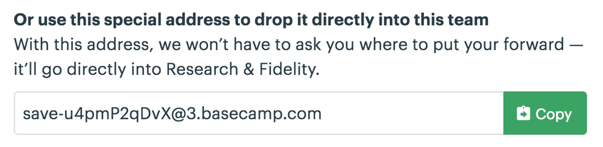

# 실제로 무언가 만들기

첫 번째 컨트롤러를 구현하고 **Stimulus**가 HTML을 자바스크립트에 연결하는 방법을 배웠습니다. 이제 **Basecamp**에서 컨트롤러를 다시 만들어 실제 응용 프로그램에서 사용할 수 있는 것들을 살펴 보겠습니다.


## Wrapping the DOM Clipboard API

**Basecamp**의 UI 전체에 다음과 같은 버튼들이 있습니다.





이 버튼 중 하나를 클릭하면 **Basecamp**가 URL 또는 이메일 주소와 같은 텍스트를 클립 보드에 복사합니다.


웹 플랫폼에는 [시스템 클립 보드에 액세스하기 위한 API](https://www.w3.org/TR/clipboard-apis/)가 있지만 우리가 필요로 하는 것을 수행하는 HTML 요소는 없습니다. 복사 버튼을 구현하려면 자바스크립트를 사용해야 합니다.


## Copy 버튼 구현하기

다른 사람에게 PIN을 생성하여 액세스 권한을 부여 할 수있는 앱이 있다고 가정 해 보겠습니다. 생성 된 PIN을 버튼과 함께 클립 보드에 복사하여 쉽게 공유 할 수 있도록 하면 편리 할 것입니다.


**public/index.html**을 열고 `<body>`의 내용을 버튼의 대략적인 스케치로 바꾸십시오.


```html
<div>
  PIN: <input type="text" value="1234" readonly>
  <button>Copy to Clipboard</button>
</div>
```


## 컨트롤러 셋업하기

**clipboard_controller.js**를 생성하고 빈 메소드 `copy()` 를 추가하십시오.


```javascript
// src/controllers/clipboard_controller.js
import { Controller } from "stimulus"

export default class extends Controller {
  copy() {
  }
}
```


그런 다음 `data-controller="clipboard"`를 `<div>`에 추가하십시오. 이 속성이 요소에 나타날 때마다 **Stimulus**는 컨트롤러의 인스턴스를 연결합니다.


```html
<div data-controller="clipboard">
```


## 타겟 정하기

클립보드 API를 호출하기 전에 내용을 선택할 수 있도록 하기 위해 텍스트 필드에 대한 참조가 필요합니다. 텍스트 필드에 `data-target="clipboard.source"` 를 추가하십시오.


```html
PIN: <input data-target="clipboard.source" type="text" value="1234" readonly>
```


이제 컨트롤러에 대상 정의를 추가하여 this.sourceTarget과 같은 텍스트 필드 요소에 액세스 할 수 있습니다.


```javascript
export default class extends Controller {
  static targets = [ "source" ]

  // ...
}
```


> `static targets` 코드라인에 대한 설명 :
>
> ----------------------------------------------------------
>
> 
>
> **Stimulus**가 컨트롤러 클래스를 로드하면 `targets`라는 정적 배열에서 타겟 이름 문자열을 찾습니다. **Stimulus**는 컨트롤러에 대해 배열의 각 타겟 이름에 해당하는  세 가지 새로운 속성을 추가합니다. 여기서는 "source"라는 타겟 이름에 근거하여 다음과 같은 속성을 자동으로 사용할 수 있게 됩니다.
>
> 
>
> - `this.sourceTarget` 는 해당 컨트롤러의 영역 내에 있는 첫번째 source 타겟를 리턴 합니다.
> - `this.sourceTargets` 는 해당 컨트롤러의 영역 내에 있는 모든 source 타겟들의 배열을 리턴 합니다.
> - `this.hasSourceTarget` 는 source 타겟이 존재할 경우 true를, 없을 경우 false를 리턴 합니다.  


## 액션 연결하기

이제 **Copy** 버튼을 연결할 준비가 되었습니다.


컨트롤러에서 버튼을 클릭하여 `copy()` 메소드를 호출하기를 원하므로 `data-action="clipboard#copy"` 를 추가하겠습니다.


```html
<button data-action="clipboard#copy">Copy to Clipboard</button>
```


> 일반적으로 이벤트는 단축 액션 표기법을 가진다
>
> ----------------------------------------------------------
>
> 
>
> 액션 기술자에서 `click->`을 생략 한 것을 알 수 있습니다. 이는 **Stimulus**가 클릭을 `<button>` 요소에 대한 기본 이벤트로 정의하기 때문입니다.
>
>
> 일부 다른 HTML 요소에도 기본 이벤트가 있습니다. 전체 목록은 다음과 같습니다.
>
>  | HTML 요소        | 기본 이벤트|
>  | ----------------- | ----------- |
>  | a                 | click       |
>  | button            | click       |
>  | form              | submit      |
>  | input             | change      |
>  | input type=submit | click       |
>  | select            | change      |
>  | textarea          | change      |
>


이제 `copy()` 메소드에서 입력 필드의 내용을 선택한 후 클립보드 API를 호출 할 수 있게 되었습니다.


```javascript
copy() {
  this.sourceTarget.select()
  document.execCommand("copy")
}
```


브라우저에 페이지를 로드하고 **Copy** 버튼을 클릭하십시오. 그런 다음 텍스트 편집기로 다시 전환한 후 붙여 넣습니다. **PIN 1234**가 표시 되어야 합니다.


## 탄력적인 사용자 인터페이스 디자인하기

클립보드 API는 현재 브라우저에서 잘 지원되지만 소수의 사람들이 여전히 애플리케이션을 사용할 때 오래된 브라우저를 사용하는  것으로 예상할 수 있습니다.


또한 사람들이 때때로 애플리케이션에 액세스하는 데 문제가 있을 것으로 예상해야 합니다. 예를 들어, 간헐적인 네트워크 연결 장애 또는 CDN 사용상의 장애로 인해 일부 또는 모든 자바스크립트가 로드되지 않을 수 있습니다.


노력을 기울일 만한 가치가 없는 오래된 브라우저에 대한 지원을 작성하거나 일시적인 발생하는 네트워크 문제가 해결된 후 새로 고침을 통해 스스로 해결하려고 합니다. 그러나 종종 이러한 유형의 문제에 대해 매우 유연한 방식으로 기능을 쉽게 구축할 수 있습니다.


일반적으로 점진적 향상(*progressive enhancement*)으로 알려진이 복원 방식은 기본 기능이 HTML 및 CSS로 구현되도록 웹 인터페이스를 제공하는 방법이며, 기본 기술에 대한 계층화된 업그레이드는 기본 기술이 브라우저에서 지원될 때 점차 CSS 와 자바스크립트로 계층화됩니다.


## PIN 필드를 점진적으로 향상시키기

브라우저에서 지원하지 않는 경우, **Copy** 버튼이 보이지 않도록 PIN 필드를 점진적으로 향상시킬 수 있는 방법을 살펴 보겠습니다. 이렇게 하면 작동하지 않는 버튼을 다른 사람에게 표시하지 않아도 됩니다.


CSS에서 **Copy** 버튼을 숨기면서 시작하겠습니다. 그런 다음 **Stimulus** 컨트롤러에서 클립보드 API에 대한 기능 테스트 지원을 제공합니다. API가 지원되는 경우 컨트롤러 요소에 클래스 이름을 추가하여 버튼을 표시합니다.


버튼 요소에 `class="clipboard-button"` 을 추가하여 시작하십시오.


```html
<button data-action="clipboard#copy" class="clipboard-button">Copy to Clipboard</button>
```


그런 다음 **public/main.css**에 다음의 스타일을 추가하십시오.


```css
.clipboard-button {
  display: none;
}

.clipboard--supported .clipboard-button {
  display: initial;
}
```


이제 API가 지원 될 때 컨트롤러에서 컨트롤러 요소에 클래스 이름을 추가하는 `connect()` 메소드를 구현하십시오.


```javascript
connect() {
  if (document.queryCommandSupported("copy")) {
    this.element.classList.add("clipboard--supported")
  }
}
```


원하는 경우 브라우저에서 자바스크립트를 비활성화하고 페이지를 다시 로드하면 **Copy** 버튼이 더 이상 표시되지 않습니다.


PIN 필드가 점진적으로 향상되었습니다. **Copy** 버튼의 기본 상태는 **hidden**이며  자바스크립트가 클립보드 API에 대한 지원을 감지할 때만 표시됩니다.


## 재사용 가능한 Stimulus 컨트롤러

지금까지 페이지에 컨트롤러 인스턴스가 하나 있을 때 어떤 일이 발생하는지 살펴 보았습니다.


페이지에 여러 컨트롤러 인스턴스가 동시에 있는 것은 드문 일이 아닙니다. 예를 들어 각각 고유한 **Copy** 버튼이 있는 PIN 목록을 표시할 수 있습니다.


컨트롤러는 재사용이 가능합니다. 약간의 텍스트를 클립보드에 복사하는 방법을 제공할 때마다 속성값을 적절하게 수정하여 페이지를 작성하면 됩니다.


계속해서 페이지에 다른 PIN을 추가해 보겠습니다. 두 개의 동일한 PIN 필드가 생성되도록 `<div>` 를 복사하여 붙여 넣은 후, 두 번째의 value 속성값을 변경한다. 


```html
<div data-controller="clipboard">
  PIN: <input data-target="clipboard.source" type="text" value="3737" readonly>
  <button data-action="clipboard#copy" class="clipboard-button">Copy to Clipboard</button>
</div>
```


페이지를 다시 로드하고 두 버튼이 모두 작동하는지 확인하십시오.


## 액션과 타겟은 모든 종류의 요소에 적용 가능

이제 PIN 필드를 하나 더 추가하겠습니다. 이번에는 버튼 대신 **Copy** *링크* 를 사용합니다.


```html
<div data-controller="clipboard">
  PIN: <input data-target="clipboard.source" type="text" value="3737" readonly>
  <a href="#" data-action="clipboard#copy" class="clipboard-button">Copy to Clipboard</a>
</div>
```


**Stimulus**는 적절한 `data-action` 속성이 있는 한 원하는 모든 종류의 요소를 사용할 수 있게 합니다.


이 경우 링크를 클릭하면 브라우저가 링크의 `href` 를 따라 이동합니다. 액션에서 `event.preventDefault()` 를 호출하여 이 기본 동작을 취소할 수 있습니다.


```javascript
copy(event) {
  event.preventDefault()
  this.sourceTarget.select()
  document.execCommand("copy")
}
```


마찬가지로 **source** 타겟은 `<input type="text">` 일 필요는 없습니다. 컨트롤러는 `value` 속성과 `select()` 메소드만 있으면 작동합니다. 즉, `<textarea>` 를 대신 사용할 수 있습니다.


```html
PIN: <textarea data-target="clipboard.source" readonly>3737</textarea>
```


## 요약 및 다음 단계

이 장에서는 브라우저 API를 **Stimulus** 컨트롤러에 래핑하는 실제 예를 살펴 보았습니다. 오래된 버전의 이전 브라우저 및 네트워크 상태 저하에 대비하여 컨트롤러를 살짝 수정했습니다. 컨트롤러 인스턴스가 여러 페이지에 한 번에 어떻게 나타날 수 있는지 보았습니다. 마지막으로 액션과 타겟이 HTML과 자바스크립트를 느슨하게 연결하는 방법을 살펴 보았습니다.


다음으로 **Stimulus** 컨트롤러가 상태를 관리하는 방법에 대해 알아 봅니다.


다음: [Managing State](https://stimulusjs.org/handbook/managing-state)


